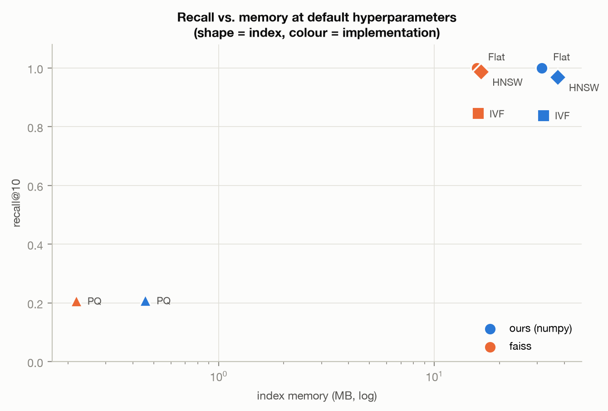
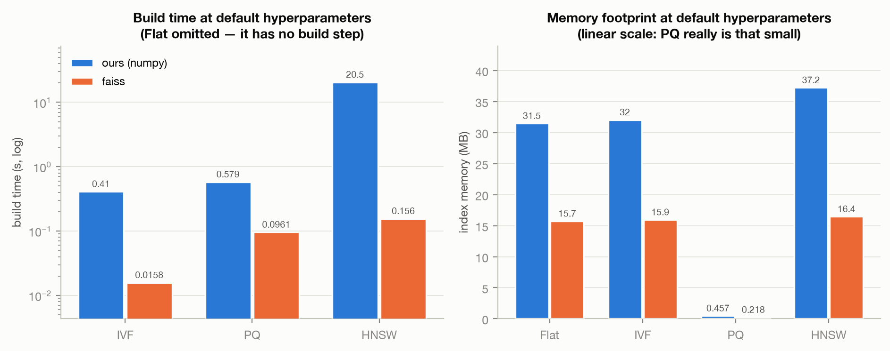
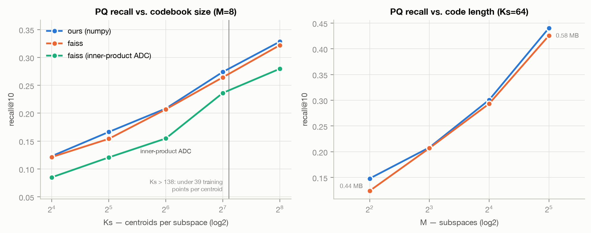
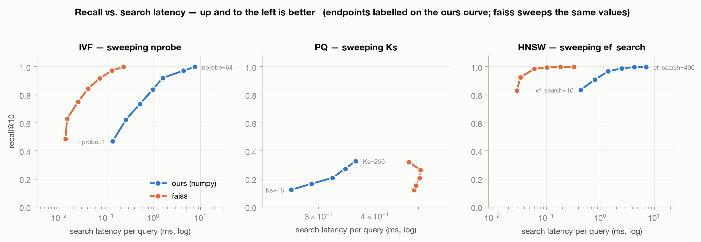

# Introduction

This report benchmarks the four approximate-nearest-neighbour indexes implemented
from scratch in `vectordb/` — Flat, IVF, PQ and HNSW, all written in numpy alone —
directly against their [faiss](https://github.com/facebookresearch/faiss)
counterparts. Each index is measured on recall, search latency, build time and
memory footprint across a grid of hyperparameters: 79 configurations in total.

The benchmark runs on **real sentence embeddings**, not synthetic vectors.
*Pride and Prejudice* is split into individual sentences and embedded with
`nomic-embed-text`; the retrieval task is semantic similarity search — find the
ten sentences closest in meaning to a user's query — which is exactly the
workload these indexes exist to serve inside a RAG pipeline. Queries are 300
held-out sentence embeddings, and every index is scored on how faithfully it
reproduces the exact top-10 answer. Random Gaussian vectors would have been
easier to generate and worthless to measure: they contain no cluster structure
for an approximate index to exploit, so every method scores near-equally badly
and the numbers reveal nothing about implementation quality.

Ours and faiss are run on the same machine, over the same vectors, against the
same ground truth, so the comparison isolates what this project's code does
differently from a production C++ library rather than measuring incidental
differences in setup.

**The short version.** The implementations are correct — every configuration that
should be exact scores precisely 1.000 — and their recall tracks faiss within
0.02 almost everywhere. The cost is speed: search runs 15–24× slower and HNSW
builds ~130× slower, which is the price of Python and float64 against C++, SIMD
and 10 OpenMP threads. Only the HNSW build gap is structural; everything else is
a constant factor. Sections 3–6 take each index in turn and set out where it is
the right tool and where it is not.

Everything here is reproducible: `examples/sweep.py` writes `sweep_results.json`,
`examples/plots.py` renders the figures and every table below.

\newpage

# 1. Setup

## Environment

| | |
|---|---|
| Machine | Apple M4, 10 cores, 16 GB, macOS 26.6.1 |
| Python | 3.12.10, numpy 2.5.1 (Accelerate BLAS) |
| faiss | faiss-cpu 1.15.0, 10 OpenMP threads |
| Ours | `vectordb/`, numpy only, float64 |

**A caveat on the timing numbers.** faiss runs multi-threaded with hand-written
SIMD kernels; our indexes are Python with numpy calls, where only the BLAS-backed
matrix products are threaded. These are honest wall-clock measurements on the same
machine and the same data, but they are *not* a single-core algorithmic comparison
— they compare what each library actually delivers as installed.

## Corpus

| | |
|---|---|
| Text | *Pride and Prejudice*, Project Gutenberg #1342 |
| Chunking | sentence-level (`chunk_sentences`, `max_sentences=1`) |
| Embeddings | `nomic-embed-text` via local Ollama, 768-dim |
| Chunks | 5,942 raw -> **5,663** after dropping duplicate embeddings |
| Indexed / queries | 5,363 indexed, **300** held-out queries |
| Metric / k | cosine, k = 10 |
| Split seed | 0 (fixed, so the index/query partition is reproducible) |

One sentence per chunk is a deliberate choice. It maximises the number of
vectors available from a single public-domain book (~5.9k), which is what makes
the larger codebook settings — `Ks=128` and above — trainable at all, and it
keeps each vector semantically narrow enough that top-10 neighbours are a
meaningful retrieval target rather than a set of near-identical paragraphs.

## Methodology

* **Ground truth** is our own `FlatIndex` exact search over the indexed set.
  recall@10 therefore measures how faithfully an approximate index reproduces the
  exact answer. Both implementations are scored against that same ground truth,
  which is what makes ours-vs-faiss directly comparable.
* **Queries are held out**, not sampled from the index: the corpus is split on a
  fixed seed into 5,363 indexed vectors and 300 query vectors, so no query is ever
  its own answer. 300 real query embeddings produce smooth recall curves that a
  dozen hand-written questions cannot. (`examples/real_search.py` covers the
  hand-written-question case qualitatively, with natural-language queries against
  the same corpus.)
* **Metric equivalence.** `nomic-embed-text` is tuned for cosine, so our indexes
  use `metric="cosine"`. faiss exposes no cosine metric for these index classes,
  so the faiss side uses the standard equivalent — L2-normalized vectors with
  inner product — except for PQ, where L2 is the correct counterpart (§5.3).
* **Reproducibility**: numpy's global RNG is reseeded before every build, because
  k-means++ init and HNSW's level assignment both draw from it. Without this,
  re-running the same configuration moved IVF recall by ~0.06 — enough to swamp
  the effect of the hyperparameter being studied. faiss seeds its own clustering
  internally and is already deterministic.
* **`nprobe` and `ef_search` are search-time only**, so those sweeps reuse a
  single built index; the build time shown in those tables is that shared build's.
* **Memory** is the index's own retained bytes — `nbytes` of every stored array
  plus real overhead for Python containers (IVF's inverted lists, HNSW's
  adjacency) — not a process-RSS delta. RSS was tried first and rejected: k-means
  training allocates large temporary distance matrices that the allocator doesn't
  return to the OS, which made PQ (the *compression* index) look larger than IVF.
  For faiss, memory is `faiss.serialize_index(...).nbytes`, since its data lives
  in a C++ heap that Python can't introspect.

## Two measurement pitfalls found while building this

Both produced convincing but incorrect numbers before they were diagnosed, so
they are worth recording.

**1. Duplicate vectors corrupt recall measurement.** Sentence-level chunking
repeats short lines verbatim ("Bennet.", "Indeed!"), and these embed to
bit-identical vectors. When several vectors sit at *exactly* the same distance
from a query, any top-k containing some of the tied set is equally correct — so
two implementations that break the tie differently appear to disagree when both
are right. The symptom was faiss's *exhaustive* `IndexFlatIP` scoring 0.956
instead of 1.000, a ceiling that silently depressed every faiss row in the
tables. All 21 of the 300 disagreeing queries were fully explained by exact
ties. Removing the 279 duplicate rows (`corpus.dedupe`) took both exact indexes
to precisely 1.000.

**2. PQ must be scored with an L2 ADC table, not inner product.** Our `PQIndex`
implements cosine by L2-normalizing and then using L2 *within each subspace*. The
natural faiss translation — normalize and use `METRIC_INNER_PRODUCT`, which is
the correct equivalent for Flat, IVF and HNSW — is the wrong comparison for PQ,
and costs faiss 0.03–0.07 recall (§5.3). The two metrics are rank-equivalent on
*exact* distances, but PQ codebooks are trained to minimize L2 reconstruction
error, so an L2 table aligns the distance computation with the objective the
codebooks were optimized for. Using the inner-product variant would have shown
our PQ "beating" faiss by roughly 0.05 across the board — an artifact of the
harness, not a property of the code.

\newpage

# 2. Results at default hyperparameters

All four indexes at their default settings.

| Index | recall@10 (ours) | recall@10 (faiss) | build s (ours) | build s (faiss) | search ms (ours) | search ms (faiss) | memory MB (ours) | memory MB (faiss) |
|---|---|---|---|---|---|---|---|---|
| Flat (exact) | 1.000 | 1.000 | 0.00 | 0.00 | 3.282 | 0.218 | 31.46 | 15.71 |
| IVF (nlist=64, nprobe=8) | 0.838 | 0.845 | 0.41 | 0.02 | 0.976 | 0.041 | 32.03 | 15.94 |
| PQ (M=8, Ks=64) | 0.208 | 0.207 | 0.58 | 0.10 | 0.322 | 0.503 | 0.46 | 0.22 |
| HNSW (M=16, efC=200, efS=50) | 0.968 | 0.987 | 20.50 | 0.16 | 1.411 | 0.061 | 37.22 | 16.45 |

{width=82%}

{width=100%}

## Choosing between the four

Each index trades a different resource for speed, and the table below summarises
what you gain and give up in each case. The sections that follow substantiate
every entry.

| Index | Strengths | Weaknesses | Reach for it when |
|:--|:-----------|:-----------|:--------|
| **Flat** | Exact by construction; no build step; no parameters to tune | Cost grows linearly with corpus size; largest memory of any index here; our slowest search at 3.28 ms | The corpus is small, or you need a ground-truth reference |
| **IVF** | Recall tunable at query time from 0.47 to exactly 1.000; builds in 0.41 s; 3× faster search than Flat at 0.84 recall | Needs a k-means training pass; recall depends on the `nprobe/nlist` ratio, so two parameters interact; no memory saving over Flat | You want a predictable accuracy/latency dial and cheap rebuilds |
| **PQ** | 68× memory reduction (0.46 MB vs 31.46 MB); fastest search of the four at 0.32 ms | Recall of 0.208 at defaults and only 0.440 at its best setting — far below every alternative | Memory is the binding constraint, and ideally as a compression layer inside IVF rather than standalone |
| **HNSW** | Highest recall of any approximate index here (0.968, up to 0.999); faster than exhaustive Flat while nearly as accurate; tunable at query time | 20.5 s to build (131× faiss) and inherently sequential; largest memory at 37.22 MB; three interacting parameters | Query latency and accuracy matter more than build time or memory |

## Three observations

**Memory is almost exactly 2× faiss for the uncompressed indexes** — 31.46 vs
15.71 MB for Flat (2.003×), 32.03 vs 15.94 MB for IVF (2.01×). That ratio is
entirely float64 against faiss's float32; there is no structural waste. HNSW is
the exception at 2.26× (37.22 vs 16.45 MB), and the excess over 2× is the Python
`dict`-of-`list` adjacency structure, where faiss uses flat contiguous arrays.

**Build time splits into two regimes.** IVF (0.41 s vs 0.016 s, 26×) and PQ
(0.58 s vs 0.096 s, 6×) stay within one order of magnitude of faiss, because
their cost is k-means, which vectorizes into BLAS calls. HNSW is 20.5 s vs
0.16 s — **131×** — because its graph is built one node at a time, and each
insertion's beam search depends on the graph left by every previous insertion.
No batching escape hatch exists; that gap is structural rather than a missed
optimization.

**PQ's compression is genuine but expensive**: 0.46 MB against Flat's 31.46 MB
is a **68× reduction**, yet 0.208 recall makes it unusable as configured. §5
shows how to spend the same bit budget far more effectively.

\newpage

# 3. Flat — the exact baseline

| Index | recall@10 | search ms | memory MB |
|---|---|---|---|
| ours | 1.000 | 3.282 | 31.46 |
| faiss | 1.000 | 0.218 | 15.71 |

**What it trades.** Flat gives up scalability for perfect accuracy: it compares
the query against every stored vector, so it can never miss a neighbour, and its
cost grows linearly with the corpus. There is nothing to train and nothing to
tune, which also means there is no dial to turn when it becomes too slow.

Both implementations are exhaustive, so both are exact by construction — the
value of this row is as a correctness check, and it passes precisely. The 15×
search gap is the cleanest available measurement of the constant-factor cost of
this project's choices: identical algorithm, identical output, float64 numpy
against float32 SIMD across 10 threads.

Note that Flat is our *slowest* index at search time (3.28 ms). Every approximate
index below beats it, which is the entire reason they exist.

# 4. IVF — cluster and probe

IVF partitions the corpus into `nlist` clusters with k-means and, at query time,
scans only the `nprobe` clusters closest to the query. **Its strength is a clean
accuracy/latency dial that can be turned at query time without rebuilding, all
the way up to exact search. Its weaknesses are a training pass, two interacting
parameters, and no memory saving at all** — every vector is still stored in full.

{width=100%}

## 4.1 `nprobe` — the recall dial

Only search changes, so build time is the one shared build.

| nprobe | % scanned | recall@10 (ours) | recall@10 (faiss) | build s (ours) | build s (faiss) | search ms (ours) | search ms (faiss) | memory MB (ours) | memory MB (faiss) |
|---|---|---|---|---|---|---|---|---|---|
| 1 | 1.6% | 0.469 | 0.486 | 0.41 | 0.02 | 0.137 | 0.014 | 32.03 | 15.94 |
| 2 | 3.1% | 0.623 | 0.630 | 0.41 | 0.02 | 0.262 | 0.015 | 32.03 | 15.94 |
| 4 | 6.2% | 0.736 | 0.750 | 0.41 | 0.02 | 0.520 | 0.025 | 32.03 | 15.94 |
| 8 | 12.5% | 0.838 | 0.845 | 0.41 | 0.02 | 0.976 | 0.041 | 32.03 | 15.94 |
| 16 | 25.0% | 0.921 | 0.918 | 0.41 | 0.02 | 1.581 | 0.073 | 32.03 | 15.94 |
| 32 | 50.0% | 0.974 | 0.974 | 0.41 | 0.02 | 4.347 | 0.132 | 32.03 | 15.94 |
| 64 | 100.0% | 1.000 | 1.000 | 0.41 | 0.02 | 7.557 | 0.231 | 32.03 | 15.94 |

This is the cleanest result in the report. Our curve and faiss's are
indistinguishable — within 0.017 at every point, crossing over twice — and both
land on **exactly 1.000 at `nprobe = 64 = nlist`**, where IVF degenerates to
exhaustive search. That endpoint is a strong correctness signal: it means our
inverted lists partition the dataset with nothing lost and nothing
double-counted.

The practical reading is that scanning 12.5% of the index buys 0.84 recall and
25% buys 0.92 — a favourable exchange, and one that can be renegotiated per
query. The limit of the trade is visible at the bottom of the table: scanning
100% via IVF (7.56 ms) is *slower* than our Flat index (3.28 ms) for the same
exact answer, because the cluster bookkeeping becomes pure overhead once
everything is being scanned anyway.

## 4.2 `nlist` — the structural choice

`nprobe` fixed at 8; each row is a fresh k-means training run.

| nlist | recall@10 (ours) | recall@10 (faiss) | build s (ours) | build s (faiss) | search ms (ours) | search ms (faiss) | memory MB (ours) | memory MB (faiss) |
|---|---|---|---|---|---|---|---|---|
| 16 | 0.956 | 0.952 | 0.36 | 0.01 | 4.485 | 0.128 | 31.75 | 15.80 |
| 32 | 0.880 | 0.891 | 0.41 | 0.01 | 1.553 | 0.074 | 31.84 | 15.85 |
| 64 | 0.838 | 0.845 | 0.40 | 0.01 | 0.986 | 0.041 | 32.03 | 15.94 |
| 128 | 0.805 | 0.795 | 0.77 | 0.02 | 0.571 | 0.029 | 32.42 | 16.13 |
| 256 | 0.753 | 0.735 | 1.23 | 0.03 | 0.438 | 0.028 | 33.19 | 16.50 |

Recall *falls* as `nlist` rises, which looks wrong at first glance but is
exactly right: at fixed `nprobe=8`, moving from 16 to 256 clusters cuts the
scanned fraction from 50% to 3%. The lesson — and the main usability cost of
IVF — is that **the ratio `nprobe/nlist` is the recall knob, not either value
alone**. `nlist` is best understood as a latency knob (4.49 ms -> 0.44 ms, a 10×
speedup bought with 0.20 recall), and it must be re-tuned alongside `nprobe`
rather than in isolation. Both implementations agree on this trend within 0.02 at
every point.

\newpage

# 5. PQ — product quantization: maximum compression, minimum recall

PQ splits each vector into `M` subspaces and replaces each one with the index of
its nearest centroid from a learned `Ks`-entry codebook, so a vector becomes a
handful of bytes. **Its strength is compression of a different order to
everything else here — 68× smaller than Flat — together with the fastest search
in the benchmark. Its weakness is accuracy: recall is 0.208 at defaults and 0.440
at the best configuration tested, well below what IVF or HNSW deliver.**

PQ is therefore the weakest performer on quality, and it receives the most
attention here for that reason. It is also the index where the two
implementations agree most closely once configured fairly, which establishes that
the weakness lies in the *method at these settings*, not in the code.

{width=100%}

## 5.1 `Ks` — bigger codebooks

5,363 training vectors, so training points per centroid = 5363/Ks.

| Ks | train pts / centroid | recall@10 (ours) | recall@10 (faiss) | build s (ours) | build s (faiss) | search ms (ours) | search ms (faiss) | memory MB (ours) | memory MB (faiss) |
|---|---|---|---|---|---|---|---|---|---|
| 16 | 335 | 0.123 | 0.121 | 0.28 | 0.05 | 0.261 | 0.489 | 0.18 | 0.07 |
| 32 | 168 | 0.166 | 0.154 | 0.41 | 0.09 | 0.289 | 0.493 | 0.27 | 0.12 |
| 64 | 84 | 0.208 | 0.207 | 0.58 | 0.10 | 0.322 | 0.503 | 0.46 | 0.22 |
| 128 | 42 | 0.274 | 0.264 | 1.00 | 0.16 | 0.344 | 0.505 | 0.83 | 0.41 |
| 256 | 21 | 0.328 | 0.322 | 1.69 | 0.30 | 0.363 | 0.476 | 1.58 | 0.79 |

Recall climbs steadily with `Ks`, and shows **no sign of the undertraining
collapse** one might expect — even at `Ks=256`, where only 21 training points per
centroid are available and faiss itself emits a "please provide at least 9984
training points" warning. The warning is real but soft: sparsely trained
codebooks still outperform coarse ones at this scale. (This is distinct from the
pathological case of training `Ks=256` codebooks on 300 vectors, which does
collapse.) Note the cost of this knob, though: from `Ks=16` to `Ks=256`, recall
rises 2.7× (0.123 -> 0.328) but memory rises 8.8× and build time 6×, which is a
poor exchange — §5.2 shows a better one.

## 5.2 `M` — more subspaces, and the better trade

Each vector is stored as M codes; more subspaces = finer approximation, more bytes.

| M | dims / subspace | recall@10 (ours) | recall@10 (faiss) | build s (ours) | build s (faiss) | search ms (ours) | search ms (faiss) | memory MB (ours) | memory MB (faiss) |
|---|---|---|---|---|---|---|---|---|---|
| 4 | 192 | 0.148 | 0.124 | 0.69 | 0.06 | 0.210 | 0.261 | 0.44 | 0.20 |
| 8 | 96 | 0.208 | 0.207 | 0.58 | 0.11 | 0.303 | 0.507 | 0.46 | 0.22 |
| 16 | 48 | 0.301 | 0.293 | 0.69 | 0.20 | 0.509 | 0.999 | 0.50 | 0.25 |
| 32 | 24 | 0.440 | 0.426 | 0.76 | 0.54 | 0.859 | 1.939 | 0.58 | 0.31 |

**This is the most useful practical finding in the report.** Compare the two ways
of spending a bit budget:

| Configuration | recall@10 | memory (ours) | compression vs Flat |
|---|---|---|---|
| `M=8, Ks=256` | 0.328 | 1.58 MB | 20× |
| `M=32, Ks=64` | **0.440** | **0.58 MB** | **54×** |

More subspaces wins on *both* axes simultaneously: +34% relative recall at 2.7×
less memory. The reason is that memory scales with `M × log2(Ks)` bits per
vector, while approximation quality depends on how few dimensions each centroid
has to represent. At `M=4`, a single 64-entry codebook must cover a
192-dimensional subspace, which is hopeless; at `M=32` it covers 24. The trend is
unbroken through `M=32` and would likely continue, at rising search cost
(0.21 ms -> 0.86 ms) as the ADC table grows. **If you tune only one PQ parameter,
tune `M`.**

Even at its best, however, 0.440 sits far below IVF (0.838) and HNSW (0.968).
**On 768-dimensional embeddings at this corpus size, standalone PQ is not a
competitive choice** — its natural role is as a compression layer inside a coarse
index (faiss's `IndexIVFPQ`), which this project does not yet implement.

## 5.3 The ADC metric finding

Identical codebooks and identical normalized vectors; only the distance table used
at search time differs.

| M | Ks | recall (ours, L2) | recall (faiss, L2) | recall (faiss, inner product) | IP penalty |
|---|---|---|---|---|---|
| 8 | 16 | 0.123 | 0.121 | 0.085 | +0.036 |
| 8 | 32 | 0.166 | 0.154 | 0.121 | +0.033 |
| 8 | 64 | 0.208 | 0.207 | 0.155 | +0.052 |
| 8 | 128 | 0.274 | 0.264 | 0.236 | +0.028 |
| 8 | 256 | 0.328 | 0.322 | 0.280 | +0.042 |
| 4 | 64 | 0.148 | 0.124 | 0.112 | +0.012 |
| 16 | 64 | 0.301 | 0.293 | 0.244 | +0.050 |
| 32 | 64 | 0.440 | 0.426 | 0.357 | +0.069 |

The inner-product ADC table costs 0.01–0.07 recall at every setting, and the
penalty grows with `M`. Two takeaways: first, for normalized vectors, prefer an
L2 ADC table even when your metric is cosine; second, our numbers match faiss's
L2 column closely (a marginal +0.006 to +0.024 in our favour, consistent with
float64 codebooks and a different k-means initialization — not a meaningful win),
whereas comparing against the IP column would have inflated our apparent
advantage to ~0.05.

One genuine advantage does show up here: **our PQ search is faster than faiss's
L2 PQ** (0.322 ms vs 0.503 ms at `M=8, Ks=64`; 0.859 vs 1.939 at `M=32`). faiss's
`IndexPQ` with `METRIC_L2` does not take its SIMD fast-scan path, while its
inner-product path does (0.050 ms — 6× faster than ours). So the honest framing is
that our vectorized ADC lookup beats one particular faiss code path, and faiss
ships faster PQ variants (`IndexPQFastScan`) that this benchmark doesn't cover.

\newpage

# 6. HNSW — highest recall, most expensive build

HNSW builds a multi-layer proximity graph and answers queries by greedy descent
followed by a beam search on the base layer. **Its strengths are the best
recall-per-query-cost of the four indexes and a beam width that can be widened
at query time to buy accuracy on demand. Its weaknesses are build cost — 20.5 s
here, and inherently sequential — the largest memory footprint of the four, and
three parameters whose effects are unequal and easy to mis-spend effort on.**

{width=100%}

## 6.1 `ef_search` — near-exact recall, tunable at query time

Search-time only, so build time is the one shared build.

| ef_search | recall@10 (ours) | recall@10 (faiss) | build s (ours) | build s (faiss) | search ms (ours) | search ms (faiss) | memory MB (ours) | memory MB (faiss) |
|---|---|---|---|---|---|---|---|---|
| 10 | 0.836 | 0.831 | 20.50 | 0.16 | 0.438 | 0.029 | 37.22 | 16.45 |
| 20 | 0.910 | 0.926 | 20.50 | 0.16 | 0.800 | 0.033 | 37.22 | 16.45 |
| 50 | 0.968 | 0.987 | 20.50 | 0.16 | 1.411 | 0.061 | 37.22 | 16.45 |
| 100 | 0.990 | 0.997 | 20.50 | 0.16 | 2.519 | 0.104 | 37.22 | 16.45 |
| 200 | 0.998 | 1.000 | 20.50 | 0.16 | 4.288 | 0.183 | 37.22 | 16.45 |
| 400 | 0.999 | 1.000 | 20.50 | 0.16 | 7.177 | 0.330 | 37.22 | 16.45 |

HNSW is comfortably the best quality-per-query-cost index of the four: 0.968
recall at 1.4 ms, and 0.990 recall at 2.5 ms — faster than our own exhaustive
Flat search (3.28 ms) while being very nearly as accurate. The returns do run
out, though. Pushing to 0.998 costs 4.3 ms, at which point Flat is both cheaper
and exact, so `ef_search=200` is only justified on a corpus large enough that
Flat's linear cost has grown past it.

Our recall matches faiss at `ef_search=10` (marginally *above*, by 0.005), then
trails by up to 0.018 in the middle of the range, with the gap closing to <=0.002
by `ef_search=200`. A likely explanation is in `_connect`
(`vectordb/index/hnsw.py`): when a node exceeds its degree cap we keep the `M`
*nearest* neighbours, whereas faiss and hnswlib apply the neighbour
*diversification* heuristic from the HNSW paper, which deliberately keeps some
longer-range edges to preserve navigability. That predicts exactly what we see —
a graph that is slightly harder to traverse, costing recall at small beam widths,
with the deficit vanishing once the beam is wide enough (`ef_search >= 200`) or the
degree cap is generous enough to compensate (`M=32`, §6.2, where both hit 0.992).
This is a reasoned hypothesis from reading both implementations, not something
this benchmark isolates directly.

## 6.2 `M` — graph degree

`ef_construction=200`, `ef_search=50`.

| M | recall@10 (ours) | recall@10 (faiss) | build s (ours) | build s (faiss) | search ms (ours) | search ms (faiss) | memory MB (ours) | memory MB (faiss) |
|---|---|---|---|---|---|---|---|---|
| 8 | 0.903 | 0.947 | 14.79 | 0.13 | 1.098 | 0.039 | 35.05 | 16.12 |
| 16 | 0.968 | 0.986 | 23.82 | 0.16 | 1.570 | 0.056 | 37.22 | 16.45 |
| 32 | 0.992 | 0.992 | 31.58 | 0.16 | 2.410 | 0.063 | 41.70 | 17.10 |

`M` is the highest-leverage HNSW parameter for our implementation: it buys +0.089
recall (0.903 -> 0.992) and closes the gap to faiss entirely at `M=32`. The price
is 2.1× build time and 6.6 MB of extra memory, which is the clearest illustration
of HNSW's central trade — accuracy is bought with a denser graph, and a denser
graph costs both time to construct and space to hold. Note that faiss's build
time barely moves with `M` (0.13 -> 0.16 s) while ours scales with it, further
evidence that our bottleneck is per-node Python overhead rather than the distance
computations themselves.

## 6.3 `ef_construction` — where *not* to spend time

`M=16`, `ef_search=50`. efC = `ef_construction`.

| efC | recall@10 (ours) | recall@10 (faiss) | build s (ours) | build s (faiss) | search ms (ours) | search ms (faiss) | memory MB (ours) | memory MB (faiss) |
|---|---|---|---|---|---|---|---|---|
| 50 | 0.961 | 0.965 | 9.01 | 0.06 | 1.206 | 0.047 | 37.20 | 16.45 |
| 100 | 0.967 | 0.981 | 14.40 | 0.10 | 1.187 | 0.055 | 37.21 | 16.45 |
| 200 | 0.968 | 0.984 | 16.87 | 0.15 | 1.066 | 0.054 | 37.22 | 16.45 |
| 400 | 0.969 | 0.984 | 25.06 | 0.25 | 1.256 | 0.057 | 37.22 | 16.45 |

Returns diminish sharply, and more so for us than for faiss: raising
`ef_construction` from 50 to 400 costs **2.8× build time (9.0 s -> 25.1 s) for
+0.008 recall**. faiss gains somewhat more (+0.019), at negligible absolute cost.

**Practical recommendation for this implementation: leave `ef_construction` at
50.** Where build time is scarce, spend it on `M` instead — `M=32, efC=50` is a
better use of the same seconds than `M=16, efC=400`. This is the parameter most
likely to absorb tuning effort for no return.

\newpage

# 7. Recall against latency, all indexes

{width=100%}

Read as Pareto frontiers, the three panels rank clearly. **HNSW dominates on
quality per unit of query time** — 0.968 recall at 1.4 ms — provided you can
afford its build. **IVF is the pragmatic workhorse**: 0.838 at 0.98 ms, tunable
all the way to exact, and it builds in 0.41 s rather than 20.5 s, which makes it
the better choice whenever the corpus changes often. **PQ is not competitive on
accuracy** at any latency; it earns its place on memory alone.

The faiss curves have the same *shape* as ours in all three panels, shifted left
by roughly an order of magnitude. Same algorithms, same trade-off structure,
different constant factor — the expected outcome for a from-scratch numpy
implementation, and for a learning project the desired one.

# 8. Assessment of the implementations

1. **Correctness is established, not assumed.** Three independent exactness
   checks pass precisely: our Flat = 1.000, faiss Flat = 1.000 against our ground
   truth, and IVF at `nprobe = nlist` = 1.000 on both sides. The last is the
   strongest, since it proves the inverted lists partition the data losslessly.
2. **Recall is competitive, with one soft spot.** IVF is within 0.017 of faiss
   across all seven `nprobe` values; PQ within 0.024 once fairly configured; HNSW
   within 0.018 across the `ef_search` sweep and exactly equal at `M=32`. The
   worst gap anywhere is HNSW at `M=8` (0.903 vs 0.947, a 0.044 deficit) — a
   sparse graph is where the missing diversification heuristic hurts most, which
   is consistent with the §6.1 hypothesis.
3. **The k-means vectorization worked.** IVF and PQ build within 6–26× of C++;
   for interpreted code, that is the BLAS doing the work. (Before vectorizing,
   the k-means-based build times were a further 100–250× slower.)
4. **HNSW's build gap is structural.** 131× is not a missing optimization: graph
   construction is inherently sequential, so it cannot be batched into BLAS calls
   the way k-means could. Closing it would mean changing languages, not changing
   numpy usage.
5. **float64 costs exactly 2× memory** and buys nothing measurable in recall.
   Moving the indexes to float32 would halve the footprint and likely speed up
   search; it is the single highest-value change available.
6. **Python container overhead is visible but small**: HNSW sits at 2.26× faiss's
   memory rather than the 2.0× that float64 alone explains.

# 9. Known gaps and recommended next steps

Ordered by value delivered per unit of effort:

* **Store vectors as float32.** Halves memory across Flat, IVF and HNSW and
  should accelerate every distance computation. Nothing in these results suggests
  float64 precision is earning its cost.
* **Add the HNSW neighbour-diversification heuristic** to `_connect`. This is the
  most likely cause of the residual recall gap (§6.1), and it is inexpensive to
  implement.
* **Implement `IVFPQ`.** PQ's real role is compression *inside* a coarse index.
  Standalone PQ at 0.208–0.440 recall is not useful, whereas IVF-then-PQ is what
  production systems actually deploy.
* **Give `KMeans` an explicit `seed` parameter.** Reseeding numpy's global RNG
  from the benchmark works, but it is a blunt instrument for library code.
* **Benchmark at larger N.** Everything here uses ~5k vectors. An earlier
  100k × 512 synthetic run put HNSW's build at roughly 18 minutes, which is the
  practical ceiling for a pure-Python graph build and deserves proper
  quantification.
* **Left unaddressed:** IVF's cosine path trains k-means with squared L2 but
  assigns with cosine distance. Results are unaffected for approximately
  normalized embeddings, and the exhaustive check still passes, but the
  inconsistency is worth tidying.

# 10. Reproducing

```bash
pip install -r py-requirements.txt      # includes faiss-cpu + matplotlib
ollama serve && ollama pull nomic-embed-text

PYTHONPATH=.:examples python examples/sweep.py    # -> sweep_results.json
PYTHONPATH=.:examples python examples/plots.py    # -> plots/*.png, plots/tables.md
```

`sweep.py` takes a few minutes, dominated by the eight HNSW graph builds. The
book text and its embeddings are cached under `examples/data/`, so only the first
run pays the download and embedding cost. Every table in this report is generated
by `plots.py` rather than transcribed by hand.
